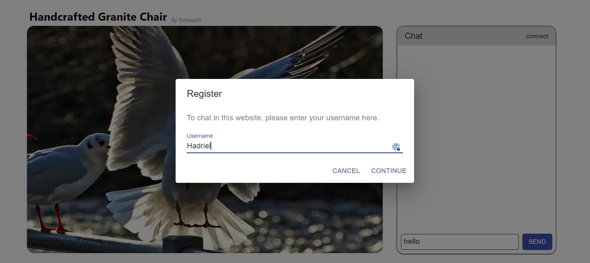

# gallery-hompage-chat

## Install 
run `npm install` in client and server directories 

## Running 
run the following to commands in saparate terminal under server directory package.json: 
* `npm run start:server`
* `npm run start:client`

Then go to: http://localhost:3000

Enjoy

Note:  
the chat messages are can be saved into localstorage or will be temporary (but anyway not saving in server database, so when clearing localstorage (or refreshing with not saving localstorage), the data will be deleted. 
can be changed in the easy way by moving from blacklist to whitelist if you want to. (file: `client/store/index.js`); 

Screenshots:

1. Fetching a static image list json from server:

   
2. Searching by name or artist

   
3. Connecting with unique username for chating

   
4. Sending chat messages per image with multiple users by sockets

   
5. Watch extra image details by mouse over

5. Watch extra message details (sending time) by mouse over 

